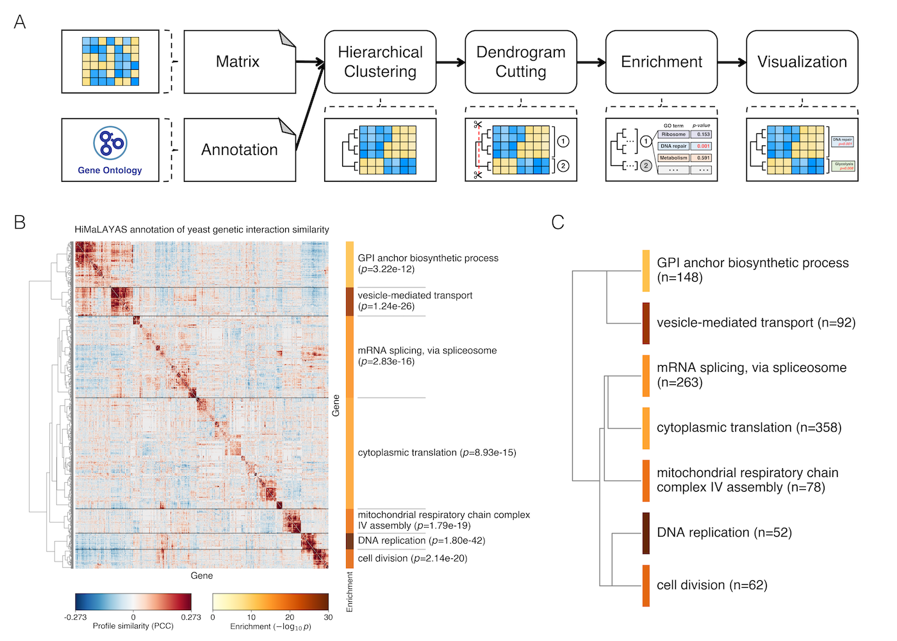

# HiMaLAYAS


[](https://pypi.python.org/pypi/himalayas)
[](LICENSE)


**Hierarchical Matrix Layout and Annotation Software** (**HiMaLAYAS**) is a
framework for post hoc enrichment-based annotation of hierarchically clustered
matrices. HiMaLAYAS treats dendrogram-defined clusters as statistical units,
evaluates annotation enrichment, and renders significant annotations alongside
their matrix regions. HiMaLAYAS supports both biological and non-biological domains.

For a full description of HiMaLAYAS and its applications, see:
<br>
Horecka, I., and Röst, H. (2026)
<br>
_HiMaLAYAS: enrichment-based annotation of hierarchically clustered matrices_
<br>
_bioRxiv_. https://doi.org/10.1101/2026.xx.xx.xxxxxx
<br>
Submitted to _Bioinformatics_.

## Documentation and Tutorial

- **Full Documentation**: [himalayas-base.github.io/himalayas-docs](https://himalayas-base.github.io/himalayas-docs)
- **Try in Browser (Binder)**: [](https://mybinder.org/v2/gh/himalayas-base/himalayas-docs/HEAD?filepath=notebooks/quickstart.ipynb)
- **Documentation Repository**: [github.com/himalayas-base/himalayas-docs](https://github.com/himalayas-base/himalayas-docs)

## Installation

HiMaLAYAS is compatible with Python 3.8 or later and runs on major operating
systems. To install the latest version, run:

```bash
pip install himalayas --upgrade
```

## Key Features of HiMaLAYAS

- **Real-Valued Matrix Input**: Operates on real-valued matrices encoding
  relationships among observations.
- **Depth-Aware Cluster Definition**: Cuts the dendrogram at a user-defined
  depth to define dendrogram-defined clusters for downstream analysis.
- **Overrepresentation Testing**: Uses a one-sided hypergeometric test to
  evaluate term enrichment in each cluster against the matrix background.
- **Multiple-Testing Control**: Supports Benjamini-Hochberg false discovery
  rate (FDR) correction for cluster-term tests.
- **Annotation Mapping and Rendering**: Maps significant annotations onto the
  clustered matrix and supports publication-ready matrix visualizations.

## Example Usage

We applied HiMaLAYAS to a hierarchically clustered
_Saccharomyces cerevisiae_ genetic interaction profile similarity matrix
(Costanzo _et al_., 2016), focusing on genes with high profile variance.
Dendrogram-defined clusters were tested for Gene Ontology Biological Process
(GO BP; Ashburner _et al_., 2000) enrichment, revealing hierarchical
organization of biological processes.


**HiMaLAYAS workflow and application to a hierarchically clustered yeast
genetic interaction profile similarity matrix (Costanzo _et al_., 2016)**.
A real-valued matrix and categorical annotations serve as inputs. The matrix is
cut at a user-defined depth, and each dendrogram-defined cluster is evaluated
for GO BP enrichment.

## Citation

### Primary citation

Horecka, I., and Röst, H. (2026)
<br>
_HiMaLAYAS: enrichment-based annotation of hierarchically clustered matrices_
<br>
_bioRxiv_. https://doi.org/10.1101/2026.xx.xx.xxxxxx
<br>
Submitted to _Bioinformatics_.

### Software archive

HiMaLAYAS software for the manuscript.
<br>
Zenodo. https://doi.org/10.5281/zenodo.18610373

## Contributing

We welcome contributions from the community:

- [Issues Tracker](https://github.com/himalayas-base/himalayas/issues)
- [Source Code](https://github.com/himalayas-base/himalayas/tree/main/src/himalayas)

## Support

If you encounter issues or have suggestions for new features, please use the
[Issues Tracker](https://github.com/himalayas-base/himalayas/issues) on GitHub.

## License

This project is distributed under the [BSD 3-Clause License](LICENSE).
